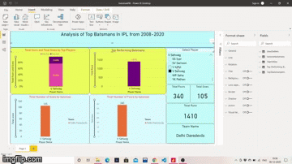

# IPLAnalysis
Here I've made Analysis on Top Players in India Premier League from 2008 to 2020 using Powerbi

Here is a GIF which illsutrates the working of PowerBI,by selecting the name of the player,all the stats
of the player will be displayed on the graphs and cards which i made

here is an enlarged view

.png)
